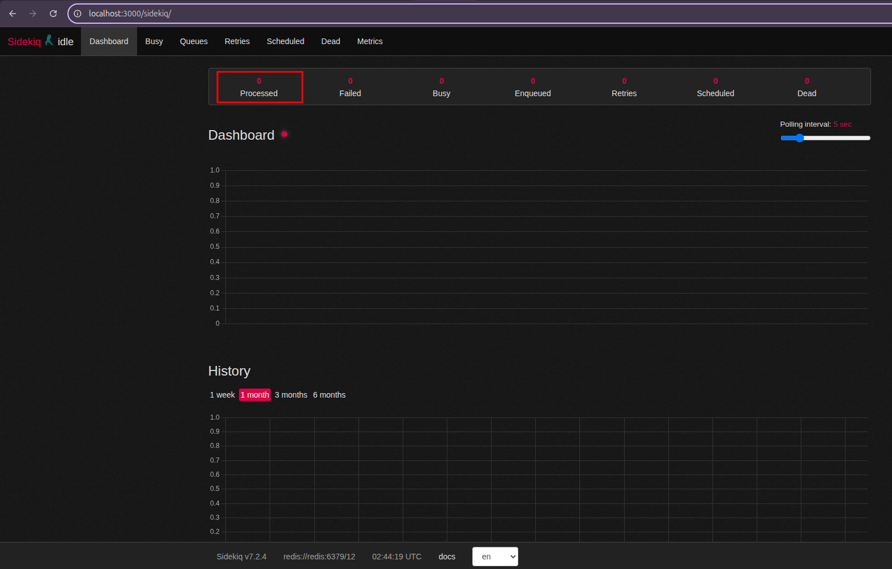
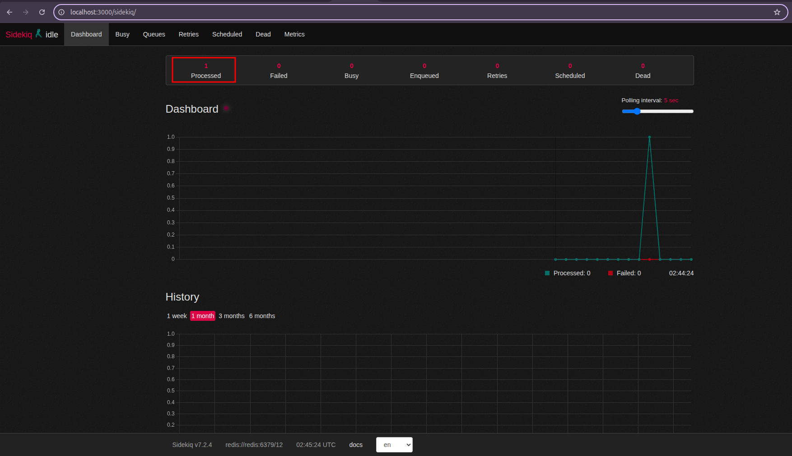

# Shopping Cart

Shopping Cart is an application that simulates shopping cart operations, allowing users to create, add items, list and remove products from a cart.

## Features

- **Cart creation:** Allows the creation of a shopping cart if a cart does not exist for the user's session.
- **Adding products to cart:** Adds products to the cart, automatically adjusting the quantity and total price.
- **Removing products from cart:** Removes specific products from the cart, updating the total price as items are deleted.
- **Dynamic price calculation:** Prices are recalculated dynamically, immediately reflecting changes when adding or removing products.
- **Scheduled job with sidekiq and redis:** Uses Sidekiq in conjunction with Redis to manage scheduled tasks, such as deleting abandoned carts, executing these operations automatically based on configured cron jobs.

## Technologies

- Ruby 3.3.1
- Rails 7.1.3.2
- RSpec 6.1.0
- PostgreSQL 16
- Redis 7.0.15

## API endpoints

| Endpoint            | Method    | Description                                                                       |
| :-------------------| :---------| :------------------------------------------------------------------------------ |
| `/cart`             | POST      | Creates a new cart and adds a product and quantity to it.                      |
| `/cart`             | GET       | Returns the current session's cart with the list of products and total price.    |
| `/cart/add_item`    | POST      | Adds a product to the cart with a specific quantity.                           |
| `/cart/:product_id` | DELETE    | Removes a product from the cart.                                              |
| `/products`         | GET       | Returns a list of all products.                                                 |
| `/products/:id`     | GET       | Returns a specific product.                                                     |
| `/products`         | POST      | Creates a new product.                                                          |
| `/products/:id`     | PATCH/PUT | Updates an existing product.                                                    |
| `/products/:id`     | DELETE    | Deletes a product.                                                              |

## Setup and execution

1. Ensure you have Docker installed locally.
2. Clone this repository:

    ```bash
    git clone git@github.com:weslley6216/shopping_cart.git
    ```

3. Navigate to the project directory:

    ```bash
    cd shopping_cart
    ```

4. Copy the `.env.example` and `.env.example.test` files to `.env` and `.env.test` respectively, to configure environment variables:

    ```bash
    cp .env.example .env
    cp .env.example.test .env.test
    ```

5. Run the project with Docker Compose:

    ```bash
    docker compose up
    ```

## Additional commands

After running `docker compose up`, open a new terminal instance and execute one of the steps below:

- **Run RSpec tests:**

    ```bash
    docker compose run --rm test
    ```

- **Open a bash shell:**

    ```bash
    docker compose exec web bash
    ```

## Interacting with the API endpoints

### Create Cart

**POST** `http://localhost:3000/cart`

**Request:**

```json
{
  "product_id": 1,
  "quantity": 1
}
```

**Response:**

```json
{
  "id": 1,
  "products": [
    {
      "id": 1,
      "name": "Samsung Galaxy S24 Ultra",
      "quantity": 1,
      "unit_price": 12999.99,
      "total_items_price": 12999.99
    }
  ],
  "total_price": 12999.99
}
```

### Add item to cart

**POST** `http://localhost:3000/cart/add_item`

**Request:**

```json
{
  "product_id": 2,
  "quantity": 1
}
```

**Response:**

```json
{
  "id": 1,
  "products": [
    {
      "id": 1,
      "name": "Samsung Galaxy S24 Ultra",
      "quantity": 1,
      "unit_price": 12999.99,
      "total_items_price": 12999.99
    },
    {
      "id": 2,
      "name": "iPhone 15 Pro Max",
      "quantity": 1,
      "unit_price": 14999.99,
      "total_items_price": 14999.99
    }
  ],
  "total_price": 27999.98
}
```

### Remove item from cart

**DELETE** `http://localhost:3000/cart/1`

**Response:**

```json
{
  "id": 1,
  "products": [
    {
      "id": 2,
      "name": "iPhone 15 Pro Max",
      "quantity": 1,
      "unit_price": 14999.99,
      "total_items_price": 14999.99
    }
  ],
  "total_price": 14999.99
}
```

### View cart

**GET** `http://localhost:3000/cart/`

**Response:**

```json
{
  "id": 1,
  "products": [
    {
      "id": 2,
      "name": "iPhone 15 Pro Max",
      "quantity": 1,
      "unit_price": 14999.99,
      "total_items_price": 14999.99
    }
  ],
  "total_price": 14999.99
}
```

### Create cart

**POST** `http://localhost:3000/cart`

**Request:**

```json
{
  "product_id": 1,
  "quantity": 1
}
```

**Response:**

```json
{
  "id": 1,
  "products": [
    {
      "id": 1,
      "name": "Samsung Galaxy S24 Ultra",
      "quantity": 1,
      "unit_price": 12999.99,
      "total_items_price": 12999.99
    }
  ],
  "total_price": 12999.99
}
```

## Managing abandoned carts with sidekiq

This application uses Sidekiq and Redis to manage abandoned shopping carts. A scheduled job `AbandonedCartsCleanupJob` runs periodically to identify and handle carts that have been inactive for a certain period.

**Job functionality:**

The `AbandonedCartsCleanupJob` performs the following actions:

1. **Marking inactive carts:** Identifies carts that have had no user interaction in the last 3 hours and marks them as "abandoned" (`abandoned: true`).
2. **Removing old abandoned carts:** Deletes carts that have been marked as abandoned for more than 7 days.

**Scheduling configuration:**

The job scheduling is configured in the Sidekiq Scheduler configuration file `config/sidekiq.yml`, as shown in the following example:

```yaml
:scheduler:
  :schedule:
    abandoned_cart_job:
      cron: "*/5 * * * *" # Executes the job every 5 minutes
      class: "AbandonedCartsCleanupJob"
```

This configuration ensures that the `AbandonedCartsCleanupJob` is executed every 5 minutes to clean up abandoned carts.

**Testing abandoned cart marking and removal:**

To verify that the abandoned cart cleanup job is working correctly, follow the steps below:

1. After running the `docker compose up` command, access the web application container:

    ```bash
    docker compose exec web bash
    ```

2. Inside the container's bash shell, open the Rails console:

    ```bash
    bundle exec rails c
    ```

3. Verify the carts created by `seeds.rb`. The `db/seeds.rb` file creates three carts with different activity states:

    - An active cart (interacted with less than 3 hours ago).
    - An inactive cart (no interaction for more than 3 hours).
    - An old abandoned cart (marked as abandoned more than 7 days ago).

    Execute the following commands in the Rails console to check the initial state of the carts:

    ```ruby
    puts "Total carts: #{Cart.count}"
    puts "Active carts: #{Cart.where.not(id: Cart.inactive_since(3.hours.ago).pluck(:id)).count}"
    puts "Inactive carts (should be abandoned): #{Cart.inactive_since(3.hours.ago).where(abandoned: false).count}"
    puts "Old abandoned carts (should be removed): #{Cart.abandoned_since(7.days.ago).count}"
    ```

4. Access the Sidekiq dashboard in your browser: [`http://localhost:3000/sidekiq`](http://localhost:3000/sidekiq). Initially, the "Processed" section should show 0 jobs, indicating that the cleanup job has not yet run:

  

5. Wait a few minutes (more than 5 minutes to ensure the scheduled job runs). Refresh the Sidekiq page. You should see one processed job in the "Processed" section, corresponding to the execution of the `AbandonedCartsCleanupJob`:

  

6. Return to the Rails console and execute the commands again to check the state of the carts after the job execution:

    ```ruby
    puts "After job execution:"
    puts "Total carts: #{Cart.count}"
    puts "Active carts: #{Cart.where.not(id: Cart.inactive_since(3.hours.ago).pluck(:id)).count}"
    puts "Abandoned carts: #{Cart.where(abandoned: true).count}"
    puts "Old abandoned carts (should have been removed): #{Cart.abandoned_since(7.days.ago).count}"
    ```

    You should observe that:

    - The inactive cart (created with `last_interaction_at` more than 3 hours ago) is now marked as `abandoned: true`.
    - The old abandoned cart (created with `updated_at` more than 7 days ago and `abandoned: true`) has been removed from the database, decreasing the total cart count.
    - The active cart remains unchanged.
